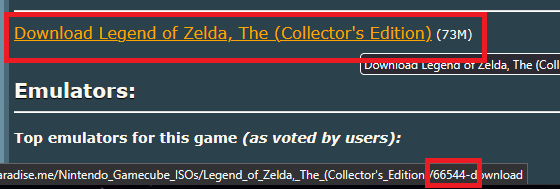
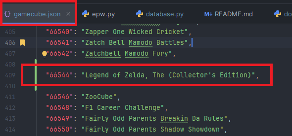

# Database Contribution

You may have realized that there are many Nintendo titles missing from the database.
At some point Emuparadise remove a bunch of Nintendo games, but they still have them on their servers.

Luckily Archive.org still has snapshots of the site containing the information we need to download these games.

[Emuparadise Snapshot](https://web.archive.org/web/20160906062321/http://www.emuparadise.me/roms-isos-games.php)
(If this link doesn't work, just go to `Archive.org` and type `Emuparadise.me` in the wayback machine.)

## Example

In this example I will add `The Legend of Zelda (Collector's Edition)` to the database.

1. Navigate to the snapshot of the website and find a game you want to add.
2. Hover over the download link and grab the digits at the end of the URL.
3. Open the corresponding json file in the database directory.
4. Add the number from the URL as the key and game title as the value.

In this example the `key` will be `66544` and the `value` will be `Legend of Zelda, The (Collector's Edition)`

